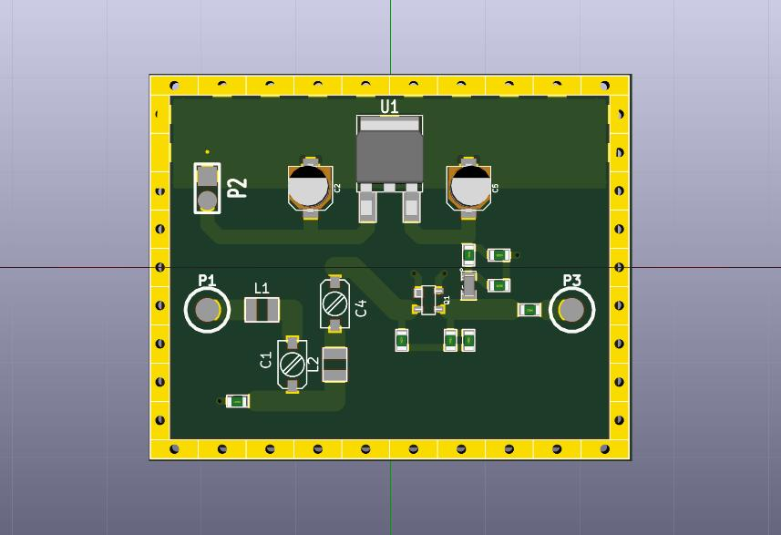
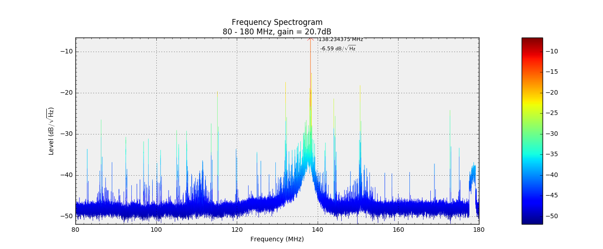
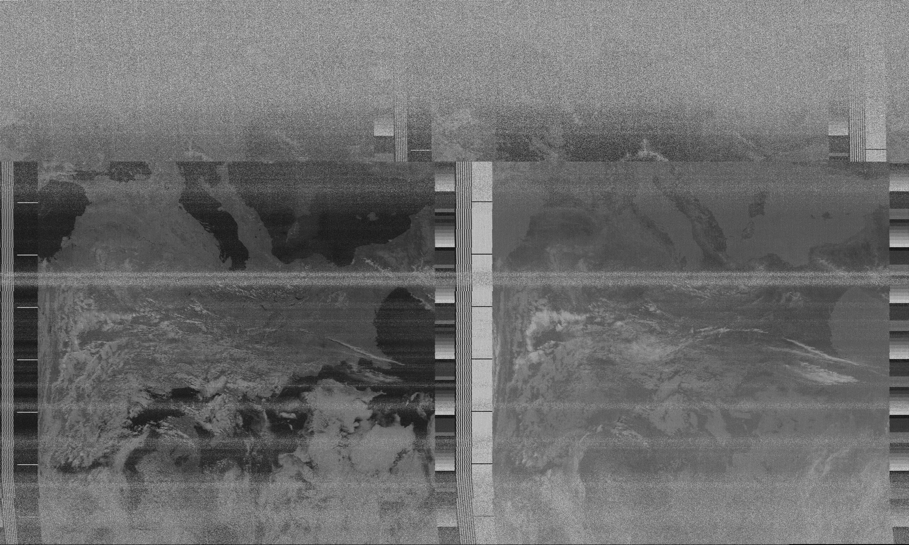

BFG 540W LNA
============
A low noise amplifier for NOAA satellite APT signals.

Original design by **YU1AW**
Refer to his [documentation](http://www.qsl.net/yu1aw/LNA/bfp196peng.htm)
for additional information and tips for tuning.

See [plot/lna.pdf](plot/lna.pdf) for the schematic and [parts.md](parts.md) for the BOM.

PCB
---

Results
--------

